<div align="center">

# Hi there, I'm Manav Acharya! 👋


</div>

<br/>

## 🚀 About Me

<table>
<tr>
<td width="50%">

I'm a passionate recent **Computer Science** graduate from **Simon Fraser University** currently focusing on **MCP (Model Context Protocol)**, **MLOps**, and **agentic AI solutions**.

### 🎯 Quick Facts

```yaml
current_focus:
  - Model Context Protocol (MCP) implementation
  - MLOps & AI infrastructure deployment
  - Agentic AI solutions & RAG pipelines

expertise:
  - Full-stack development (React, Next.js, Node.js)
  - DevOps & cloud infrastructure (AWS, GCP, K8s)
  - AI/ML automation & workflow orchestration

recent_work:
  - AI Automation & DevOps Engineer at TideSpark
  - Full Stack Developer & IT Intern at Operto
  - Information Systems Coordinator at YMCA BC
```

### 🎮 Hobbies & Interests

- ♟️ **Chess** - Strategic thinking & problem solving
- 🎮 **Gaming** - Autobattlers & strategic multiplayer
  games
- 💪 **Fitness** - Calisthenics & strength training
- 🎵 **Music** - Playlist curation & discovery
- 🧗 **Bouldering** - Climbing & outdoor adventures

</td>
<td width="50%">

### 📫 Let's Connect!

[](mailto:manavxa@gmail.com)
[](https://linkedin.com/in/manav-acharya)
[](https://manav.world)
[](tel:+16049672772)

### 💬 Ask Me About

<p>


</p>

### 🎵 Recently Played on Spotify

[](https://spotify-github-profile.vercel.app/api/view?uid=12167639251&redirect=true)

</td>
</tr>
</table>

## 🛠️ Technical Skills

```mermaid
%%{init: {'theme':'dark', 'themeVariables': { 'primaryColor':'#FF5722', 'primaryTextColor':'#fff', 'primaryBorderColor':'#FF6B35', 'lineColor':'#FF8C00', 'secondaryColor':'#0d1117', 'tertiaryColor':'#161b22', 'fontSize':'16px'}}}%%
mindmap
  root((Manav's<br/>Tech Stack))
    Languages
      JavaScript ⭐⭐⭐⭐⭐
      TypeScript ⭐⭐⭐⭐⭐
      Python ⭐⭐⭐⭐⭐
      Java ⭐⭐⭐⭐
      C# ⭐⭐⭐
      C++ ⭐⭐⭐⭐
    AI/ML & Data Science
      LangChain
      Prefect
      Elastic
      RAG Pipelines
      LLM Deployment
      MLOps
    Web Development
      React/Next.js
      Node.js
      Angular
      MySQL
      REST APIs
    Cloud & DevOps
      AWS
      GCP
      Docker
      Kubernetes
      Terraform
      CI/CD
    Databases & Tools
      MySQL
      Redis
      Git
      Linux
```

<div align="center">



</div>

### 💻 Programming Languages

<table>
<tr>
<td align="center" width="96">

<br><span style="color: white;">JavaScript</span>
</td>
<td align="center" width="96">

<br><span style="color: white;">TypeScript</span>
</td>
<td align="center" width="96">

<br><span style="color: white;">Python</span>
</td>
<td align="center" width="96">

<br><span style="color: white;">Java</span>
</td>
<td align="center" width="96">

<br><span style="color: white;">C#</span>
</td>
<td align="center" width="96">

<br><span style="color: white;">HTML</span>
</td>
<td align="center" width="96">

<br><span style="color: white;">CSS</span>
</td>
<td align="center" width="96">

<br><span style="color: white;">C++</span>
</td>
</tr>
</table>

### 🤖 AI/ML & Data Science

<table>
<tr>
<td align="center" width="96">

<br><span style="color: white;">TensorFlow</span>
</td>
<td align="center" width="96">

<br><span style="color: white;">PyTorch</span>
</td>
<td align="center" width="96">

<br><span style="color: white;">Scikit-learn</span>
</td>
<td align="center" width="96">

<br><span style="color: white;">Pandas</span>
</td>
<td align="center" width="96">

<br><span style="color: white;">NumPy</span>
</td>
<td align="center" width="96">

<br><span style="color: white;">LangChain</span>
</td>
<td align="center" width="96">

<br><span style="color: white;">Elastic</span>
</td>
</tr>
</table>

### 🌐 Web Development & Frameworks

<table>
<tr>
<td align="center" width="96">

<br><span style="color: white;">Node.js</span>
</td>
<td align="center" width="96">

<br><span style="color: white;">React</span>
</td>
<td align="center" width="96">

<br><span style="color: white;">Next.js</span>
</td>
<td align="center" width="96">

<br><span style="color: white;">Angular</span>
</td>
<td align="center" width="96">

<br><span style="color: white;">jQuery</span>
</td>
<td align="center" width="96">

<br><span style="color: white;">.NET</span>
</td>
<td align="center" width="96">

<br><span style="color: white;">Express</span>
</td>
<td align="center" width="96">

<br><span style="color: white;">Tailwind</span>
</td>
</tr>
</table>

### ☁️ Cloud & DevOps

<table>
<tr>
<td align="center" width="96">

<br><span style="color: white;">Git</span>
</td>
<td align="center" width="96">

<br><span style="color: white;">Docker</span>
</td>
<td align="center" width="96">

<br><span style="color: white;">Kubernetes</span>
</td>
<td align="center" width="96">

<br><span style="color: white;">AWS</span>
</td>
<td align="center" width="96">

<br><span style="color: white;">GCP</span>
</td>
<td align="center" width="96">

<br><span style="color: white;">Vercel</span>
</td>
<td align="center" width="96">

<br><span style="color: white;">Terraform</span>
</td>
<td align="center" width="96">

<br><span style="color: white;">GitHub Actions</span>
</td>
</tr>
</table>

### 🗄️ Databases & Tools

<table>
<tr>
<td align="center" width="96">

<br><span style="color: white;">MySQL</span>
</td>
<td align="center" width="96">

<br><span style="color: white;">Redis</span>
</td>
<td align="center" width="96">

<br><span style="color: white;">Firebase</span>
</td>
<td align="center" width="96">

<br><span style="color: white;">MongoDB</span>
</td>
<td align="center" width="96">

<br><span style="color: white;">PostgreSQL</span>
</td>
<td align="center" width="96">

<br><span style="color: white;">Prisma</span>
</td>
<td align="center" width="96">

<br><span style="color: white;">Supabase</span>
</td>
</tr>
</table>

## 📊 GitHub Stats & Activity

<div align="center">

<table>
<tr>
<td width="50%">


</td>
<td width="50%">


</td>
</tr>
</table>


<details>
<summary><b>📈 More Stats</b></summary>

<br/>

<table>
<tr>
<td width="50%">


</td>
<td width="50%">


</td>
</tr>
</table>


</details>

</div>

---

## 💬 Let's Connect!

<div align="center">


<br/>

### 📫 Reach Out

<table>
<tr>
<td align="center" width="25%">
<a href="https://linkedin.com/in/manav-acharya">

</a>
<br/>
<b>Professional Networking</b>
</td>
<td align="center" width="25%">
<a href="https://manav.world">

</a>
<br/>
<b>View My Work</b>
</td>
<td align="center" width="25%">
<a href="mailto:manavxa@gmail.com">

</a>
<br/>
<b>Send a Message</b>
</td>
<td align="center" width="25%">
<a href="tel:+16049672772">

</a>
<br/>
<b>+1 604 967 2772</b>
</td>
</tr>
</table>

<br/>

### 📊 Profile Analytics


<br/>

---

<br/>

<sub>⭐️ From [ManavX](https://github.com/ManavX) | Built with ❤️ and lots of ☕</sub>

<br/>


</div>
